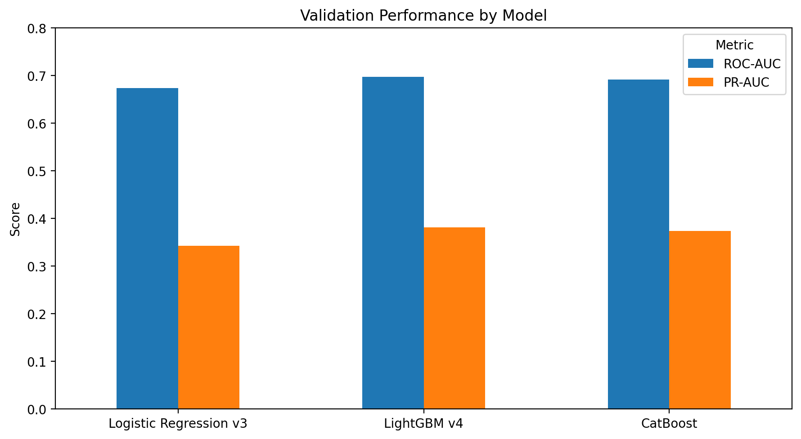
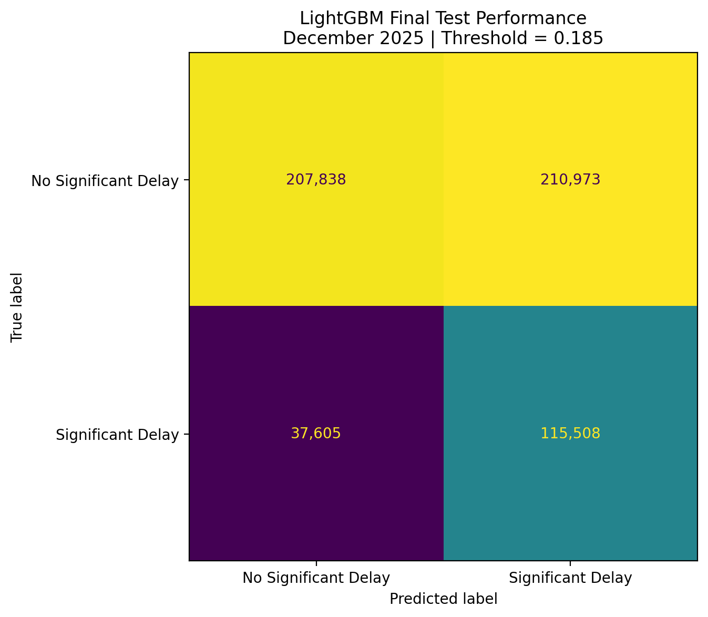
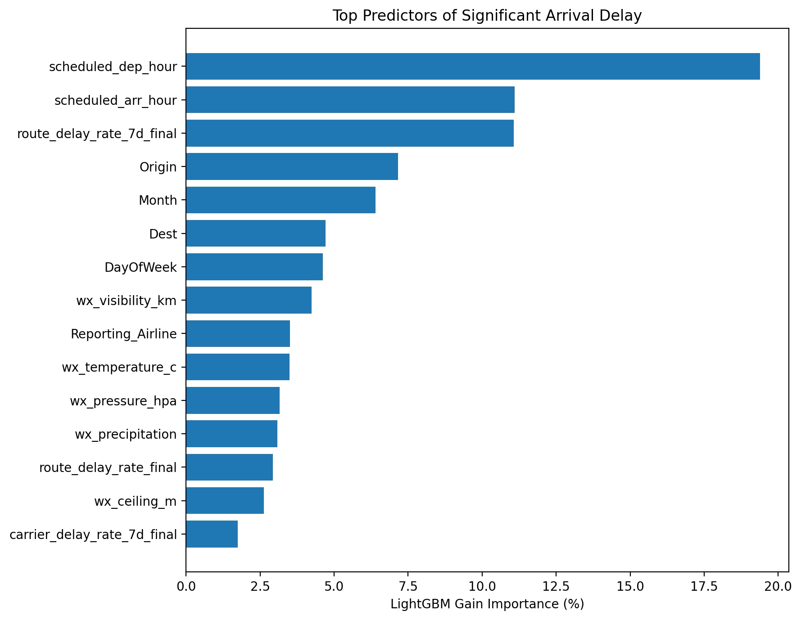

# ✈️ Flight Operations Intelligence
## Predicting Significant U.S. Flight Delays Before Departure

An end-to-end machine learning project that combines **6.88 million U.S. domestic flights** with **NOAA weather observations** to estimate the risk of significant arrival delays before departure.

The project covers the full workflow from large-scale data processing and external data integration to temporal feature engineering, model comparison, threshold selection, and out-of-time evaluation.

---

## 📌 Results at a Glance

- ✈️ **6.88M** U.S. domestic flights analyzed
- 🌦️ BTS flight operations integrated with hourly NOAA weather observations
- 🗄️ Large-scale transformations performed with **DuckDB + Parquet**
- 🤖 **Logistic Regression, LightGBM, and CatBoost** evaluated
- 🎯 **75.4% recall** on unseen December 2025 flights
- 📈 **0.687 ROC-AUC**
- 📊 **0.460 PR-AUC**
- ⚙️ Built with **Python, SQL, DuckDB, pandas, scikit-learn, LightGBM, and CatBoost**

### Final Model Performance

| Metric | Out-of-Time Test Result |
|---|---:|
| ROC-AUC | **0.687** |
| PR-AUC | **0.460** |
| Precision | **0.354** |
| Recall | **0.754** |
| F1 Score | **0.482** |
| Decision Threshold | **0.185** |

> **Operational interpretation:** At the selected threshold, the model identifies approximately **75% of significantly delayed flights**, but generates a substantial number of false-positive alerts. It is therefore better interpreted as an **operational risk-screening system** than as a definitive prediction of whether an individual flight will be delayed.

---

## 🎯 Business Problem

Flight delays create significant operational, financial, and customer-service challenges for airlines and airports.

They can contribute to:

- Aircraft and crew scheduling disruptions
- Missed passenger connections
- Gate and airport congestion
- Increased operating costs
- Customer-service challenges
- Downstream network effects

The objective of this project is to answer:

> **Can information available before departure be used to identify flights at elevated risk of experiencing a significant arrival delay?**

A significant delay is defined as:

> **Arrival delay ≥ 15 minutes**

Rather than simply maximizing classification accuracy, the project treats delay prediction as an **operational risk-identification problem**.

---

## 🏗️ System Architecture

```text
BTS Flight Data ───────────────┐
                               │
                               ▼
                       DuckDB + Parquet
                               │
                               ▼
                    Flight Data Processing
                               │
                               ├──────────────────────┐
                               │                      │
                               ▼                      ▼
                    Historical & Rolling       NOAA Weather Data
                    Operational Features              │
                               │                      │
                               └──────────┬───────────┘
                                          │
                                          ▼
                                  Feature Dataset
                                          │
                                          ▼
                                Chronological Split
                                          │
                           ┌──────────────┼──────────────┐
                           ▼              ▼              ▼
                         Train       Validation         Test
                           │              │
                           ▼              │
                 Model Development       │
                           │              │
                 ┌─────────┼─────────┐    │
                 ▼         ▼         ▼    │
              Logistic  LightGBM  CatBoost
                 │         │         │
                 └─────────┼─────────┘
                           ▼
                    Model Comparison
                           │
                           ▼
                  Threshold Selection
                    (Validation Only)
                           │
                           ▼
                     Locked Model
                           │
                           ▼
                Out-of-Time Test Evaluation
                           │
                           ▼
                 Flight Delay Risk Score
```

---

## 📊 Data Sources

### Bureau of Transportation Statistics (BTS)

The primary dataset consists of **2025 Reporting Carrier On-Time Performance** records from the U.S. Bureau of Transportation Statistics.

Flight-level information includes:

- Reporting airline
- Origin airport
- Destination airport
- Scheduled departure time
- Scheduled arrival time
- Scheduled elapsed time
- Flight distance
- Arrival delay
- Cancellation status
- Diversion status

Cancelled flights, diverted flights, and records without an arrival-delay outcome are excluded from the modeling population.

The resulting modeling dataset contains approximately:

> **6.88 million flights**

### NOAA Weather

Hourly NOAA weather observations are integrated with the flight dataset using airport and scheduled flight-time information.

Weather variables include:

- Temperature
- Wind speed
- Visibility
- Atmospheric pressure
- Precipitation
- Ceiling height

Missing-weather indicators are retained so that the models can distinguish between an observed weather value and an unavailable observation.

This is important because weather-data coverage is not uniform across every airport, station, variable, and time period.

---

## 🗄️ Data Engineering

Processing millions of flight records alongside hourly weather observations required a workflow designed for datasets larger than convenient in-memory pandas operations.

The project therefore uses:

- **DuckDB** for SQL-based analytical transformations
- **Parquet** for efficient columnar storage
- **pandas** for downstream modeling and analysis
- **Python** for orchestration, feature engineering, and machine learning

The general data flow is:

```text
Raw BTS / NOAA Data
        ↓
      DuckDB
        ↓
      Parquet
        ↓
 SQL Transformations
        ↓
Flight + Weather Features
        ↓
Machine Learning
```

This architecture keeps large-scale transformation work in DuckDB while using pandas primarily for downstream modeling.

---

## 🧠 Feature Engineering

All predictive variables are designed around a critical constraint:

> **The information must be available before the scheduled departure of the flight.**

This reduces the risk of target leakage and makes the evaluation more representative of a real pre-departure prediction setting.

### Schedule and Flight Features

Features include:

- Airline
- Origin airport
- Destination airport
- Month
- Day of week
- Scheduled departure hour
- Scheduled arrival hour
- Weekend indicator
- Scheduled elapsed time
- Flight distance

### Historical Operational Features

Historical performance variables summarize delay behavior observed **before the current flight**.

Features include:

- Historical carrier delay rate
- Historical origin delay rate
- Historical destination delay rate
- Historical route delay rate
- Prior carrier flight count
- Prior origin flight count
- Prior destination flight count
- Prior route flight count

These variables allow the model to learn longer-term operational patterns without incorporating the current flight's outcome.

### Rolling 7-Day Features

Long-run historical averages may not capture rapidly changing operating conditions.

Rolling seven-day features therefore represent recent performance, including:

- Carrier 7-day delay rate
- Origin 7-day delay rate
- Destination 7-day delay rate
- Route 7-day delay rate
- Prior 7-day flight counts

These variables allow the model to incorporate short-term operational conditions alongside longer-run historical patterns.

### Weather Features

NOAA weather observations are joined to scheduled flights using airport and time information.

Weather variables provide additional information about environmental conditions potentially associated with disruption risk.

---

## 🔒 Leakage Prevention

Target leakage is a major risk in flight-delay modeling because many variables recorded after departure would make prediction artificially easy.

This project therefore excludes information that would not be available at prediction time.

Historical and rolling statistics are constructed using **prior observations only**, preventing the current flight's outcome from contributing to its own predictive features.

The modeling question is intentionally constrained to:

> **What could reasonably be known before departure?**

---

## ⏱️ Time-Based Model Validation

Random train/test splitting can produce overly optimistic results when observations have strong temporal structure.

Instead, the project uses chronological train, validation, and test periods.

| Dataset | Period | Flights | Delay Rate |
|---|---|---:|---:|
| Training | Jan 2 – Sep 30, 2025 | 5,133,923 | 22.25% |
| Validation | Oct 1 – Nov 30, 2025 | 1,156,866 | 20.44% |
| Test | Dec 1 – Dec 31, 2025 | 571,924 | 26.77% |

The December test dataset remains untouched during model development and threshold selection.

This creates a more realistic evaluation of how the model performs on future operational conditions.

The change in delay prevalence is also notable: the delay rate increased from **20.44% during validation to 26.77% during the December test period**, illustrating why temporal evaluation matters.

---

## 🤖 Models Evaluated

Three classification approaches were compared.

### 1. Logistic Regression

Used as an interpretable linear baseline to establish whether the engineered features contain meaningful predictive information.

### 2. LightGBM

A gradient-boosted decision-tree model capable of learning nonlinear relationships and interactions across schedule, historical, operational, and weather features.

### 3. CatBoost

A gradient-boosting model with native handling of categorical variables such as airline, origin airport, destination airport, month, and day of week.

---

## 📏 Evaluation Strategy

Significant delays represent the minority class, so **accuracy alone is not an appropriate measure of model quality**.

Evaluation therefore emphasizes:

- **ROC-AUC** — overall ranking ability
- **PR-AUC** — precision-recall performance under class imbalance
- **Precision** — proportion of flagged flights that actually experience significant delay
- **Recall** — proportion of significantly delayed flights successfully identified
- **F1 Score** — balance between precision and recall

For an operational risk-screening use case, recall is particularly important because missed high-risk flights represent false negatives.

However, increasing recall also increases false-positive alerts, creating an operational tradeoff.

---

## 📉 Model Comparison

Logistic Regression, LightGBM, and CatBoost were compared before selecting the final model.



**LightGBM** was selected as the final model based on the overall validation results and the project's operational objective.

---

## 🏆 Final Model: LightGBM

The classification threshold was selected using the validation dataset rather than the final test data.

Once selected, the threshold was locked before evaluating performance on December flights.

> **Locked decision threshold: 0.185**

This separation prevents the final test dataset from influencing model or threshold selection.

---

## 📈 Out-of-Time Test Performance

The final LightGBM model produced the following results on **571,924 unseen December 2025 flights**:

| Metric | Result |
|---|---:|
| ROC-AUC | **0.687** |
| PR-AUC | **0.460** |
| Precision | **0.354** |
| Recall | **0.754** |
| F1 Score | **0.482** |

At the locked threshold, the model identifies approximately:

> **75% of flights that ultimately experience significant arrival delays.**

The tradeoff is relatively low precision:

> Approximately **35% of flights flagged by the model** actually experience a significant delay.

The model should therefore **not** be interpreted as saying:

> "This flight will be delayed."

Instead, its output is better interpreted as:

> **"This flight has elevated disruption risk and may warrant additional operational attention."**

This distinction is important when translating classification metrics into a potential operational use case.

---

## 🚦 Final Model Confusion Matrix

The confusion matrix shows the behavior of the locked LightGBM model on the unseen December test period.



It provides an operational view of the threshold tradeoff by showing:

- Correctly identified delayed flights
- Missed delayed flights
- Correctly identified non-delayed flights
- False-positive delay alerts

---

## 🔍 Model Feature Importance

According to LightGBM feature importance, the model relies heavily on schedule, recent operational performance, airport, airline, and weather information.



Important features include:

- Scheduled departure hour
- Scheduled arrival hour
- Recent route delay performance
- Origin airport
- Destination airport
- Month
- Day of week
- Visibility
- Airline
- Temperature
- Atmospheric pressure
- Precipitation
- Ceiling height

Recent route performance was particularly informative, supporting the value of combining **short-term operational history** with schedule and weather information.

> Feature importance describes how the trained model uses variables internally and should not be interpreted as evidence that a feature causes flight delays.

---

## 💡 Key Findings

### 1. Recent operational history provides useful predictive information

Rolling route, airport, and carrier performance provides signals beyond static schedule characteristics.

Recent route performance was particularly informative.

### 2. Temporal validation matters

Delay prevalence changed substantially across the year.

The December test period had a **26.77% delay rate**, compared with **20.44% during validation**.

This demonstrates why evaluating the model on future time periods provides a more realistic test than randomly distributing flights across training and testing datasets.

### 3. Threshold selection is an operational decision

A probability model does not automatically determine which flights should trigger action.

The selected **0.185 threshold** favors recall, allowing the system to identify approximately three-quarters of significantly delayed flights while accepting more false-positive alerts.

A different operational objective could justify a different threshold.

### 4. Predictive performance has practical limits

Flight delays depend on factors not available in this dataset, including aircraft rotations, crew availability, maintenance events, air-traffic restrictions, and network propagation effects.

The model therefore provides **risk information rather than certainty**.

---

## 🏢 Potential Operational Use

In a real airline or airport environment, a model of this type could contribute to a broader operational decision-support system.

Flights with elevated predicted risk could potentially be surfaced for:

- Operations monitoring
- Passenger-connection planning
- Gate-management attention
- Customer-service preparation
- Disruption-management workflows

The model would serve as one input into a larger operational decision process rather than as an autonomous decision maker.

---

## 📁 Repository Structure

```text
flight-operations-intelligence/
│
├── data/
│   ├── raw/
│   └── processed/
│
├── models/
│
├── notebooks/
│
├── reports/
│   ├── figures/
│   │   ├── lightgbm_feature_importance.png
│   │   ├── lightgbm_test_confusion_matrix.png
│   │   └── model_comparison.png
│   └── results/
│
├── src/
│
├── .gitignore
├── README.md
└── requirements.txt
```

### Directory Overview

**`data/`**  
Raw and processed datasets used throughout the project.

**`models/`**  
Saved model artifacts.

**`notebooks/`**  
Data profiling, feature engineering, modeling, and evaluation workflow.

**`reports/figures/`**  
Model comparison, test evaluation, and feature-importance visualizations.

**`reports/results/`**  
Model metrics and supporting analytical outputs.

**`src/`**  
Reusable project code supporting data processing and modeling workflows.

> Large raw and processed datasets are excluded from GitHub where appropriate.

---

## 📦 Project Outputs

The completed workflow produces:

- Integrated flight-weather feature dataset
- Historical operational features
- Rolling seven-day features
- Logistic Regression baseline
- LightGBM model
- CatBoost model
- Model comparison results
- Locked classification threshold
- Out-of-time test evaluation
- Confusion matrix
- Feature importance analysis
- Saved final model artifact
- Reproducible modeling workflow

---

## 🛠️ Technology Stack

### Data Engineering
`DuckDB` `SQL` `Parquet`

### Data Analysis
`Python` `pandas`

### Machine Learning
`scikit-learn` `LightGBM` `CatBoost`

### Data Sources
`BTS On-Time Performance` `NOAA Weather`

### Development
`Jupyter` `VS Code` `Git` `GitHub`

---

## ⚠️ Limitations

This project should be interpreted as a **flight-delay risk modeling system**, not a production airline decision platform.

### Weather Coverage

Weather observations do not perfectly represent conditions at every airport and scheduled flight time.

Precipitation also has substantially lower coverage than several primary weather variables.

### Missing Operational Variables

The dataset does not contain several potentially important real-time airline operational factors, including:

- Aircraft rotations
- Crew availability
- Maintenance events
- Gate constraints
- Air-traffic-control restrictions
- Incoming-aircraft delays
- Network-level disruption propagation

### Temporal Drift

The model is trained and evaluated using 2025 data.

Relationships between schedule characteristics, weather, airport operations, and delays may change over time.

Production use would therefore require:

- Performance monitoring
- Data-quality monitoring
- Drift detection
- Periodic retraining
- Threshold reassessment

### Prediction vs. Causation

The model identifies statistical patterns associated with future delays.

Feature importance and model predictions should **not** be interpreted as causal estimates of why a particular flight was delayed.

---

## 🚀 Potential Next Steps

If this system were extended toward production, useful additions could include:

- Real-time weather forecasts
- Aircraft-tail and rotation information
- Incoming-aircraft delay propagation
- Air-traffic-control and NAS restriction data
- Airport congestion indicators
- Model calibration analysis
- Prediction-level explainability
- Automated drift monitoring
- Model serving through an API
- Operational dashboard integration

These are intentionally treated as future extensions rather than requirements for the current project.

---

## 📚 Data Sources

- **U.S. Bureau of Transportation Statistics (BTS)** — Reporting Carrier On-Time Performance data
- **National Oceanic and Atmospheric Administration (NOAA)** — Hourly weather observations used for airport weather integration

---

## 👤 Author

**Tsering Tashi Gurung**

MBA graduate and PhD student specializing in Information Technology and Artificial Intelligence, with interests in **machine learning, data analytics, AI systems, and business decision support**.

---

## ⭐ Project Summary

This project demonstrates an end-to-end approach to applied machine learning using large-scale, real-world transportation data:

> **6.88M flights → external weather integration → large-scale data processing → temporal feature engineering → leakage prevention → model comparison → threshold selection → out-of-time evaluation → operational interpretation**

The goal is not simply to produce the highest possible model score, but to demonstrate how a machine learning problem can be structured, evaluated, and interpreted in a way that reflects a realistic business decision context.
